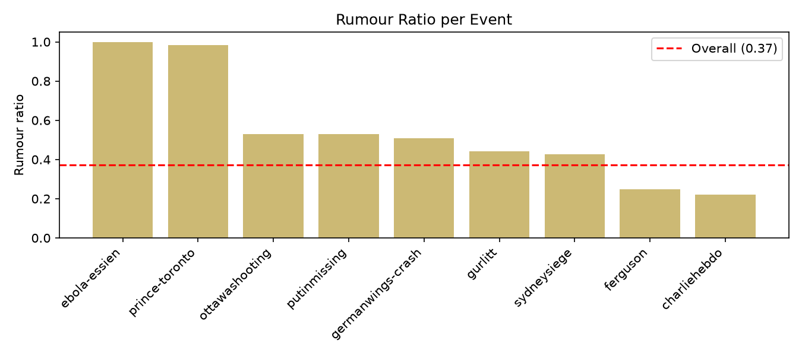

# PHEME Rumour Detection Baseline

This project compares TF-IDF and BERT for rumour detection on the PHEME dataset. It focuses on how the two models differ under random vs. event-based splits to assess cross-event generalisation, and uses a two-way error analysis to diagnose systematic model bias.

## Background

A rumour is information that spreads online while still unverified at the time — it may later prove true or false. Because rumours often spread faster than they can be verified, detecting them early is important yet difficult. This project uses the PHEME dataset, which contains tweets from nine real breaking-news events labelled as rumour or non-rumour. It first cleans the raw data, then trains TF-IDF and BERT models, and — through random vs. event-based splits — honestly assesses how well each generalises to unseen events, including where they fail.

## Dataset

PHEME organises nine real events as nested JSON files. Under each event, tweets are split into `rumours/` and `non-rumours/` sub-folders, so the label comes from the folder structure rather than a separate label file. Each tweet folder contains the source tweet, reactions, and annotations; this project uses only the source-tweet text. I traverse all nine events, extract the `text` field from each source tweet's JSON, label it by its folder (rumour = 1, non-rumour = 0), record its source event, and aggregate everything into 6,425 labelled tweets stored as a CSV.

## Data Processing

**Deduplication.** I deduplicate first, to prevent the same tweet from landing in both the training and test sets — which would leak information and inflate scores through "cheating." I also found one tweet labelled as *both* rumour and non-rumour: a genuine annotation conflict that would feed the model contradictory signals and whose true label is unreliable. I therefore removed both of its copies. This reduced the dataset from 6,425 to 6,406 tweets.

**URLs.** URLs are replaced with a `[URL]` token. The specific link adds little for rumour detection and is mostly noise, but the fact that a tweet *contains* a link may be informative — so I keep a placeholder rather than deleting it outright.

**Mentions.** Mentions (`@username`) are collapsed into a single `@USER` token. Thousands of distinct usernames are sparse noise to the model; unifying them lets it learn the signal "a mention exists" instead of memorising who, reducing noise and overfitting.

**Hashtags.** I strip only the `#` symbol and keep the word (`#Germanwings` → `Germanwings`). Otherwise TF-IDF would treat `#Germanwings` and the plain word `Germanwings` as two separate tokens, diluting the signal for the same concept.

The original text is preserved in a `text_raw` column so that cleaning can always be inspected and traced.

## Exploratory Analysis

Three findings from the cleaned data shaped the later design:

**Class imbalance.** Non-rumours outnumber rumours about 1.7:1 (4,012 vs 2,394). A model that simply always predicts "non-rumour" would still reach over 60% accuracy, so I evaluate with macro-F1 and rumour recall instead of accuracy.

**Highly uneven event sizes.** Events range from 14 tweets (ebola-essien) to over 2,000 (charliehebdo). Very small events are unreliable as a test set — a score computed over 14 examples is statistically meaningless — so such events must be avoided when designing the event-based split.

**Rumour ratio varies dramatically across events**, from 22% to 100%. This is the key finding: a model could "cheat" by recognising which event a tweet belongs to and guessing that event's dominant label — a form of event-level data leakage. This motivated evaluating under both a random split and an event-based split.



## Experiments

I fine-tune BERT (`bert-base-uncased`, 3 epochs) and train a TF-IDF + Logistic Regression baseline, evaluating both under the random and event-based splits.

| Model  | Split       | Macro-F1 | Rumour Recall |
|--------|-------------|----------|---------------|
| TF-IDF | Random      | 0.848    | 0.808         |
| BERT   | Random      | 0.869    | 0.833         |
| TF-IDF | Event-based | 0.665    | 0.503         |
| BERT   | Event-based | 0.725    | **0.676**     |

Three observations:

**The two models are close on the random split** (F1 0.848 vs 0.869). This split lets TF-IDF "cheat" by memorising rumour-related words seen in training; since tweets from the same events reappear at test time, memorisation is enough, and BERT's semantic understanding gives little advantage.

**Both drop sharply on the event-based split** (F1 falls to 0.66–0.72). With the test set drawn from entirely unseen events, this confirms that the event leakage flagged during EDA is real and substantial.

**But BERT drops less and recovers more recall** (TF-IDF 0.503 → BERT 0.676). Facing unseen vocabulary in new events, TF-IDF can only match words it has already seen and misses many rumours, whereas BERT's subword tokenisation and semantic understanding let it recognise rumours even from words it has not seen before.

## Error Analysis

I ran a two-way error analysis on the BERT model under the event-based split, and each error type turned out to concentrate on a single event:

**False negatives (rumours predicted as non-rumours) fall almost entirely in putinmissing.** These political rumours read like serious news — calm wording, quoted experts, attached media links — and lack the sensational, urgent cues the model learned from other events, so they slip through as credible reports.

**False positives (non-rumours predicted as rumours) fall almost entirely in ottawashooting.** These are actually real breaking-news tweets, but their aggressive, panicked, urgent wording (e.g. BREAKING, lockdown warnings) matches the "rumour tone" the model learned, so they are misclassified.

Both directions point to the same conclusion: **the model judges by emotional style (sensational vs. calm) rather than by whether the content is actually verified.** In other words, it has learned "sensational style" as a surface proxy instead of the essence of a rumour (unverified information) — which also explains why it fails to generalise to events with a different style.

## Key Findings

On the random split, both TF-IDF and BERT reach solid scores — but largely by exploiting event leakage, having seen tweets from the same events during training. Under the event-based split, facing entirely unseen events, both drop sharply, showing that cross-event generalisation is the real challenge.

More deeply, the two models fail in different ways but for the same reason: **both learn surface features rather than the essence of a rumour.** TF-IDF judges by memorising rumour-related words from the training set and breaks on unseen vocabulary; BERT, though it understands semantics, still largely judges by the emotional style of the wording and is fooled by rumours written in an unfamiliar tone. A rumour is fundamentally *unverified information*, and judging it should rest on verifying the content — which neither model truly does. This is the root cause of their poor generalisation.

This points toward a more promising direction: having models retrieve evidence and verify claims rather than guessing from surface cues in the text.

## Repository Structure

- `prepare_data.py` — Load raw PHEME JSON, deduplicate and clean, output `pheme_clean.csv`
- `eda.py` — Exploratory analysis; saves plots to `results/`
- `split_data.py` — Random stratified split and event-based split
- `train_tfidf_compare.py` — TF-IDF + Logistic Regression baseline (both splits)
- `train_bert.py` — BERT fine-tuning (run on Colab GPU)
- `error_analysis.py` — Two-way error analysis (false negatives / false positives)
- `results/` — EDA plots

The raw PHEME data and the generated CSV files are not tracked in git (see `.gitignore`); they are regenerated from the scripts.

## How to Run

Environment is managed with [uv](https://github.com/astral-sh/uv).

**1. Data preparation.** Download the PHEME dataset ("PHEME dataset for Rumour Detection and Veracity Classification", figshare) into `data/`, then:

```bash
uv run python prepare_data.py    # → data/pheme_clean.csv
uv run python eda.py             # → plots in results/
uv run python split_data.py      # → splits in data/
```

**2. TF-IDF baseline** (runs locally):

```bash
uv run python train_tfidf_compare.py
```

**3. BERT** (Google Colab with GPU): upload the split CSVs to Google Drive, mount Drive, `pip install transformers datasets`, then run `train_bert.py`; run `error_analysis.py` on the trained event-split model to reproduce the error analysis.

## Future Work

- **Improve cross-event generalisation**, since both models rely on surface features (vocabulary or emotional style) rather than verifying content. Approaches that retrieve external evidence or reason over claims are a promising direction.
- **Address event-specific leakage** — e.g. numeric hashtags like `#4U9525` act as event identifiers and may let models shortcut rather than learn genuine rumour cues.
- **Select the best epoch using a validation set** for the event-based split, as the models showed overfitting (rising validation loss) after the first epoch.
- **Clean residual noise** in the dataset (a few off-topic tweets, e.g. sports posts, appear under some events).
